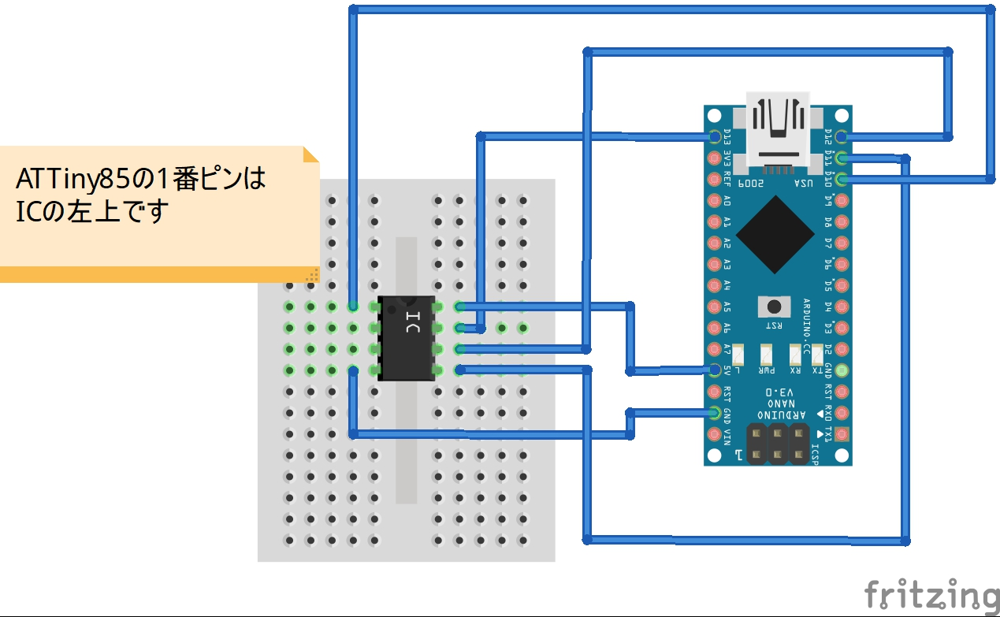

# ATTiny85への書き込み
ここではプログラムをATTiny85へ書き込む方法を説明します。

## Arduinoのプログラマ化

## Arduinoとの配線
ブレッドボードとジャンパーケーブルを使用して下図のように配線します。

ブレッドボード

## ボードの設定

## 内蔵クロックの設定
ATTiny85は工場出荷時に内蔵クロックが1MHzに設定されています。

## プログラムの書き込み
